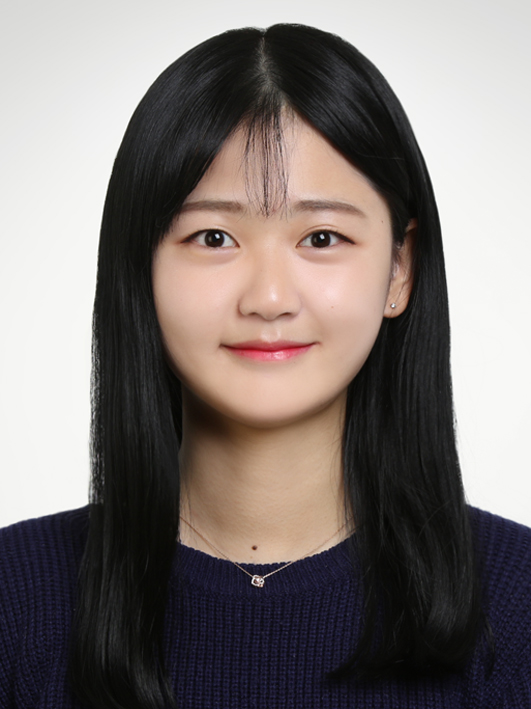

## About Me

Hi! I am a MS/Ph.D student in the Department of Computer Science and Engineering at Korea University. My advisor is Prof. <a href="https://scholar.google.co.kr/citations?user=HMTkz7oAAAAJ&amp;hl=ko&amp;oi=ao">Heuiseok Lim</a>, and I am part of the <a href="http://nlp.korea.ac.kr/">Natural Language Processing & Artificial Intelligence Lab</a>. See CV for more information.

 <!-- This is a jekyll based resume template. You can find the full source code on [GitHub] --> 
 <!-- (https://github.com/bk2dcradle/researcher) -->

## Research Interest
Neural Machine Translation, Quality Estimation, Curriculum Learning

## Education & Professional Experience
2022.03 - Now: M.S/PH.D student in Computer Science and Engineering, Korea University  
2019.07 - 2019.09: Research Intern, ETRI  
2016.03 - 2020.08: B.A. in Linguistics&Cognitive Science, Language&Technology, Hankuk University of Foreign Studies

## Academic Services
Program committee (Reviewer): NAACL 2022-Industry Track   

## Publications
### Preprints 
1. [A Self-Supervised Automatic Post-Editing Data Generation Tool](https://arxiv.org/abs/2111.12284)  
Hyeonseok Moon, **Chanjun Park**, Sugyeong Eo, Jaehyung Seo, SeungJun Lee, Heuiseok Lim  
*arxiv, 2021* 

2. [Empirical Analysis of Korean Public AI Hub Parallel Corpora and in-depth Analysis using LIWC](https://arxiv.org/abs/2110.15023)  
**Chanjun Park**, Midan Shim, Sugyeong Eo, Seolhwa Lee, Jaehyung Seo, Hyeonseok Moon, Heuiseok Lim  
*arxiv, 2021* 

### Top Conference (Main / Workshop)
1. A Dog Is Passing Over The Jet? A Text-Generation Dataset for Korean Commonsense Reasoning and Evaluation  
Jaehyung Seo, Seounghoon Lee, **Chanjun Park**, Yoonna Jang, Hyeonseok Moon, Sugyeong Eo, Seonmin Koo, Heuiseok Lim  
*NAACL 2022 - Findings, 2022* 

2. Priming Ancient Korean Neural Machine Translation  
**Chanjun Park**, Seolhwa Lee, Hyeonseok Moon, Sugyeong Eo, Jaehyung Seo, Heuiseok Lim  
*LREC 2022, 2022 - (Oral presentation)* 

3. Empirical Analysis of Synthetic Data Generation Using Noising Strategies for Automatic Post-editing  
Hyeonseok Moon, **Chanjun Park**, Seolhwa Lee, Jaehyung Seo, Jeongsub Lee, Sugyeong Eo, Heuiseok Lim  
*LREC 2022, 2022 - (Poster)* 

4. [How should human translation coexist with NMT? Efficient tool for building high quality parallel corpus](https://arxiv.org/abs/2111.00191)  
**Chanjun Park**, Seolhwa Lee, Hyeonseok Moon, Sugyeong Eo, Jaehyung Seo, Heuiseok Lim  
*NeurIPS 2021 - Data-centric AI (DCAI) workshop, 2021* 

5. [A New Tool for Efficiently Generating Quality Estimation Datasets](https://arxiv.org/abs/2111.00767)  
Sugyeong Eo, **Chanjun Park**, Jaehyung Seo, Hyeonseok Moon, Heuiseok Lim  
*NeurIPS 2021 - Data-centric AI (DCAI) workshop, 2021* 

6. [Automatic Knowledge Augmentation for Generative Commonsense Reasoning](https://arxiv.org/abs/2111.00192)  
Jaehyung Seo, **Chanjun Park**, Sugyeong Eo, Hyeonseok Moon, Heuiseok Lim  
*NeurIPS 2021 - Data-centric AI (DCAI) workshop, 2021* 

7. [BTS: Back TranScription for Speech-to-Text Post-Processor using Text-to-Speech-to-Text](https://aclanthology.org/2021.wat-1.10/) 
**Chanjun Park**, Jaehyung Seo, Seolhwa Lee, Chanhee Lee, Hyeonseok Moon, Sugyeong Eo, Heuiseok Lim 
*ACL 2021 -WAT(Workshop on Asian Translation) 2021 Workshop, 2021 - (oral presentation)* 

8. [Dealing with the Paradox of Quality Estimation](https://aclanthology.org/2021.mtsummit-LoResMT.1/)  
Sugyeong Eo, **Chanjun Park**, Jaehyung Seo, Hyeonseok Moon, Heuiseok Lim **(Equal Contribution(First Co-Author))**  
*MT Summit 2021 - LoResMT, 2021 - (Oral presentation)* 

9. [Should we find another model?: Improving Neural Machine Translation Performance with ONE-Piece Tokenization Method without Model Modification](https://aclanthology.org/2021.naacl-industry.13/) 
**Chanjun Park**, Sugyeong Eo, Hyeonseok Moon, Heuiseok Lim 
*NAACL-HLT 2021 Industry Track, 2021- (Poster/Oral presentation)* 

### International Journal (SCI/SCIE)
1. Word-level Quality Estimation for Korean-English Neural Machine Translation  
Sugyeong Eo, **Chanjun Park**, Hyeonseok Moon, Jaehyung Seo, Heuiseok Lim **(Equal Contribution(First Co-Author))**  
*IEEE Access, 2022* 

2. [Dense-to-Question and Sparse-to-Answer: Hybrid Retriever System for Industrial Frequently Asked Questions](https://www.mdpi.com/2227-7390/10/8/1335)  
Jaehyung Seo, Taemin Lee, Hyeonseok Moon, **Chanjun Park**, Sugyeong Eo, Imatitikua D AIyanyo, Kinam Park, Aram So, Sungmin Ahn, Jeongbae Park  
*Mathematics, 2022*  

3. [Mimicking Infants’ Bilingual Language Acquisition for Domain Specialized Neural Machine Translation](https://ieeexplore.ieee.org/document/9751075) 
**Chanjun Park**, Woo-Young Go, Sugyeong Eo, Hyeonseok Moon, Seolhwa Lee, Heuiseok Lim  
*IEEE Access, 2022* 

4. [An Automatic Post Editing with Efficient and Simple Data Generation Method](https://ieeexplore.ieee.org/document/9714400) 
Hyeonseok Moon, **Chanjun Park**, Jaehyung Seo, Sugyeong Eo, Heuiseok Lim **(Equal Contribution(First Co-Author))**  
*IEEE Access, 2022* 

5. [An Empirical Study on Automatic Post Editing for Neural Machine Translation](https://ieeexplore.ieee.org/document/9528385)  
Hyeonseok Moon, **Chanjun Park**, Sugyeong Eo, Jaehyung Seo, Heuiseok Lim **(Equal Contribution(First Co-Author))**  
*IEEE Access, 2021* 

6. [Comparative Analysis of Current Approaches to Quality Estimation for Neural Machine Translation](https://www.mdpi.com/2076-3417/11/14/6584) 
Sugyeong Eo, **Chanjun Park**, Hyeonseok Moon, Jaehyung Seo, Heuiseok Lim **(Equal Contribution(First Co-Author))**  
*Applied Sciences, 2021* 

### Domestic Patents
1. DEVICE AND METHOD FOR GENERATING OF TRAINING DATA FOR QUALITY ESTIMATION IN MACHINE TRANSLATION  
HeuiSeok Lim, Sugyeong Eo, **Chanjun Park**, Hyeonseok Moon  

2. DEVICE AND METHOD FOR GENERATING TRAINING DATA FOR AUTOMATIC POST EDITING  
HeuiSeok Lim, Hyeonseok Moon, **Chanjun Park**, Sugyeong Eo  

   
